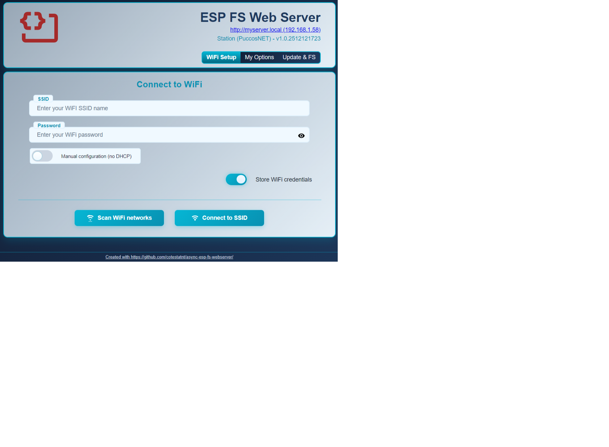
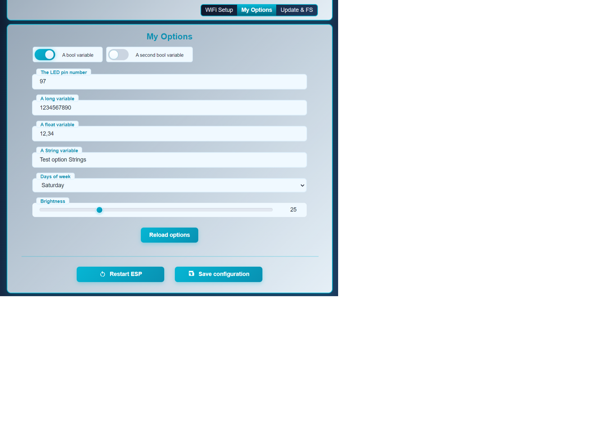
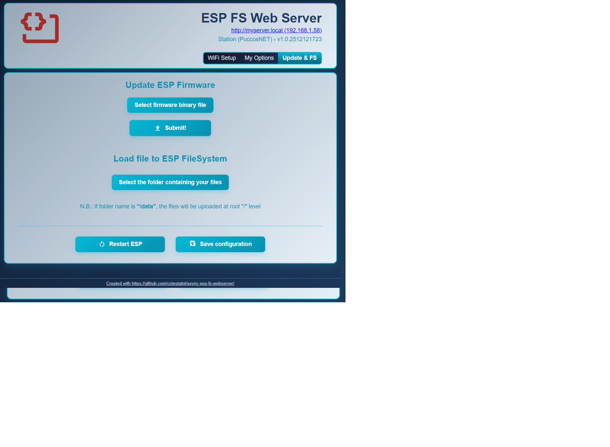
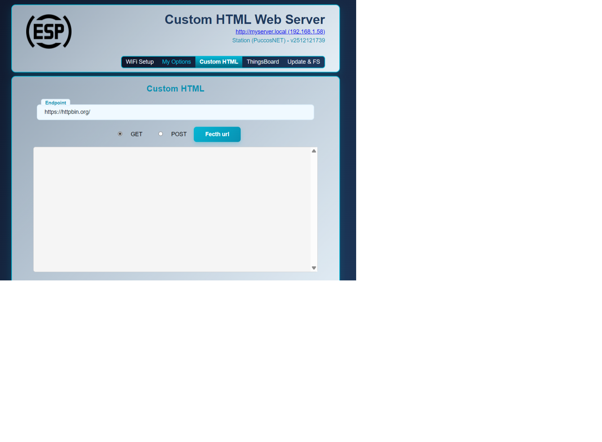
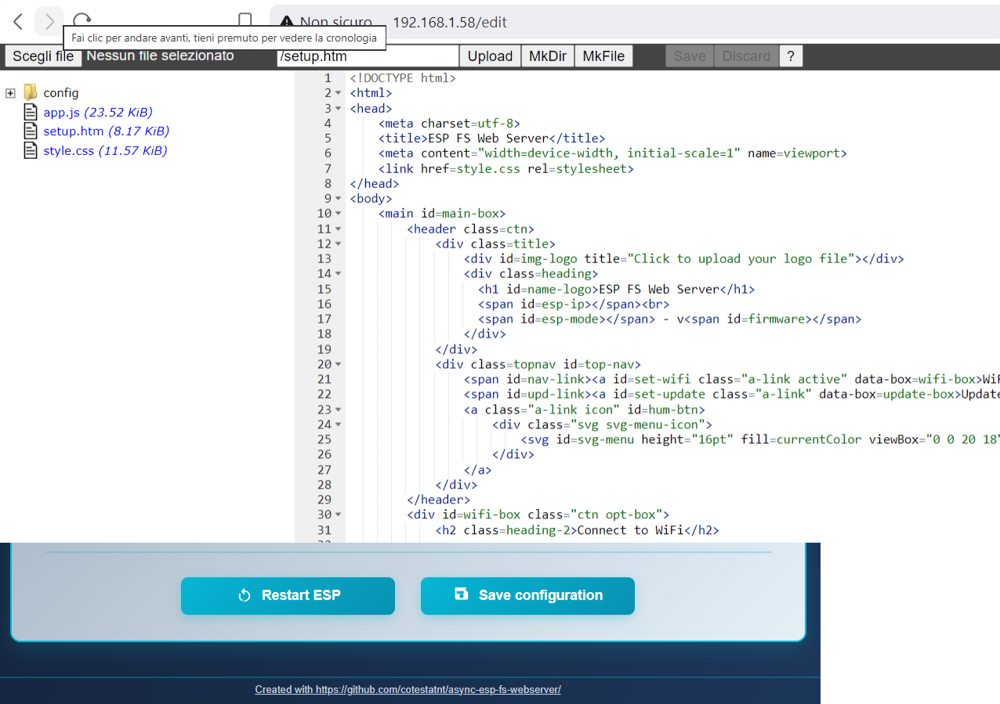

# AsyncFsWebServer
ESP32/ESP8266 web server, WiFi manager, and ACE web editor Arduino library. Based on [ESPAsyncWebServer](https://github.com/ESP32Async/ESPAsyncWebServer) by @ESP32Async.

This library is the async equivalent of [**esp-fs-webserver**](https://github.com/cotestatnt/esp-fs-webserver/): it uses the **ESP Async WebServer** library instead of the default web server.

## Dependencies
Install the following dependencies. Remove any previously installed clones or old versions first, as they may cause conflicts.

- ESP32: https://github.com/ESP32Async/AsyncTCP
- ESP8266: https://github.com/ESP32Async/ESPAsyncTCP
- ESP32/ESP8266: https://github.com/ESP32Async/ESPAsyncWebServer

## Documentation (available methods + usage)
- [docs/API.md](docs/API.md)
- [docs/SetupAndWiFi.md](docs/SetupAndWiFi.md)
- [docs/FileEditorAndFS.md](docs/FileEditorAndFS.md)
- [docs/WebSocket.md](docs/WebSocket.md)

**Note**:
Starting from version 2.0.0, the ESP32 Arduino core introduced **LittleFS**, like ESP8266. The examples in this library are written to use it by default on both platforms. Change this if you prefer other file systems.

## WiFi and options manager
Thanks to the built-in **/setup** page (about 8 KB of program space), you can scan and set WiFi credentials and other freely configurable parameters.

## Web server file upload and OTA updates
The **/setup** page also allows remote firmware updates (OTA).

In addition to built-in firmware update functionality, you can also upload your web server content all at once (typically the files are placed inside the folder `data` of your sketch).

This page can also be extended with custom HTML and JavaScript code to create smart and powerful web applications.

In the image below, for example, HTML and JavaScript code to provision devices on the well-known [ThingsBoard IoT platform](https://thingsboard.io/) is added at runtime from the Arduino sketch (see the [customHTML](https://github.com/cotestatnt/async-esp-fs-webserver/tree/master/examples/customHTML) example).

## ACE web file editor/browser
Thanks to the built-in **/edit** page, you can upload, delete, and edit HTML/CSS/JavaScript source files directly from your browser and immediately view changes at runtime, without recompiling the firmware.
The page can be enabled at runtime using `enableFsCodeEditor()` and it occupies about 6.7 KB of program space.

If you like this work, please consider [sponsoring this project!](https://paypal.me/cotesta)
